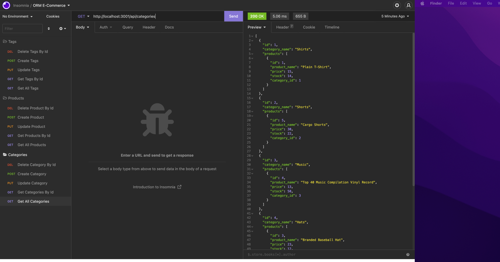

# ORM-E-Commerce

## Table of Content

-[Description](#description)
-[Usage](#usage)
-[Installation](#installation)
-[Visuals](#visuals)
-[Resources](#resources)
-[Authors and Acknowledgement](#authors-and-acknowledgement)

## Description 

This is a ORM E-Commerce Back End Application that works with Express.js API and configure using Sequeilize to interact with the MySQL database. This application works on the command line and below is a demo showing how to run and use this application.

## Usage

How to use this ORM E-Commerce Back End Application

- Step 1: Download all the require installation

- Step 2: Go into MySQL shell to create the schema for the database

- Step 3: Exit MySQL shell, and in terminal, type npm install seed, to seed the database 

- Step 4: Type in "nodemon" to start the server and open the server in the Insomnia Core

- Step 5: Test the CRUD operation in Insomnia and you are able to create, read, update, delete either the Cateogry, Product, or Tag model

## Installation

Since all the dependencies/packages are listed in the package.json, you can just run the command  
```
npm i
```

If you prefer downloading each dependencies/packages one by one, these are the command for it 

```
npm i dotenv
```

```
npm i express
```

```
npm i mysql2
```

```
npm i sequelize
```

## Visuals

Here is a sample of what should appear in Insonmia Core if you following all the direction and installation



## Resources

- [GitHub Repo](https://github.com/VanessaLiaw021/orm-e-commerce)

DEMO: Insonmia Core to Create Schema and Seed in the Database, GET all Categories, GET all Product, GET all Tags
- [Demo SQL Command and GET ALL item from the Models](https://drive.google.com/file/d/1gbKkaU0ElmWFYYqW9spYSspka1ZYKwPH/view)

DEMO: Insonmia Core, GET a Single Category, GET a Single Product, Get A Single Tag
- [Demo GET A Single item from the Model](https://drive.google.com/file/d/1380A7bSV2dyNcB7L8_G-mqRnYhCiukOH/view)

DEMO: Insonmia Core, POST, UPDATE, DELETE Operation for Category, Product, and Tag
- [Demo POST, UPDATE, DELETE for all Model](https://drive.google.com/file/d/19eZlJFSkZlupMYs9Hd4edXDGQTgoTnlX/view)

## Authors and Acknowledgement

Starter Code provided by Bookcamp programmers

Coded models and routes folder by Vanessa Liaw